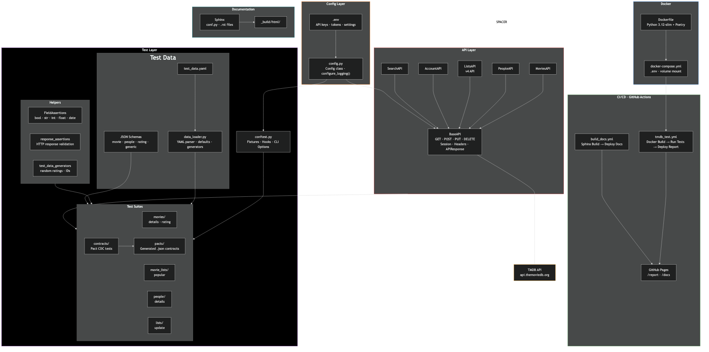
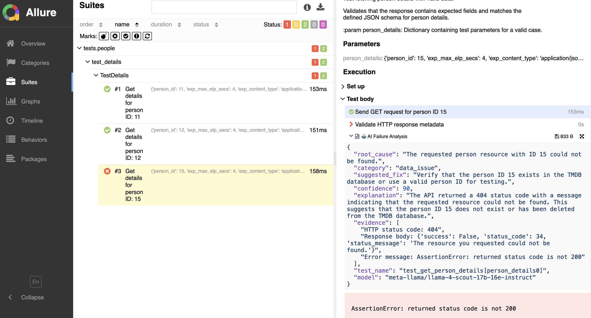
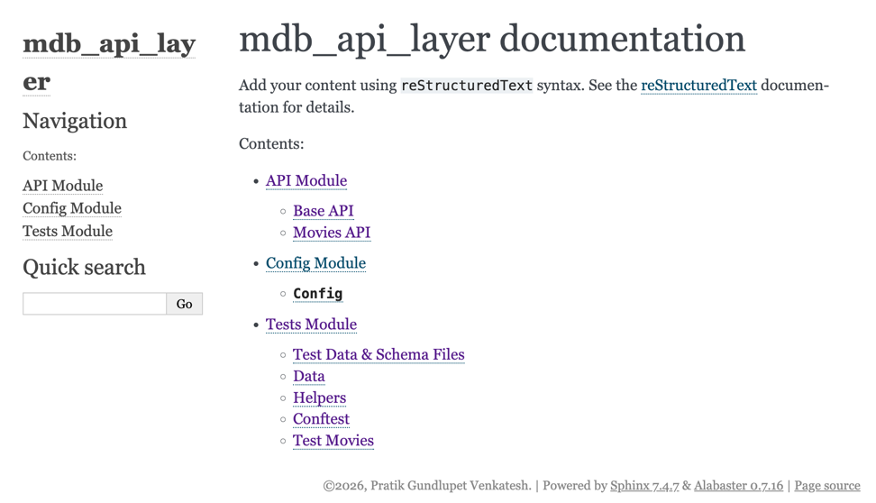
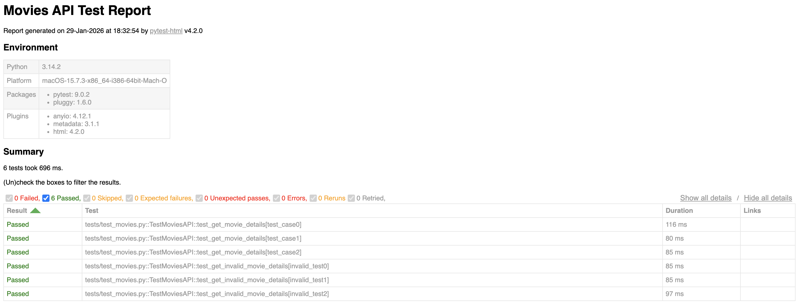
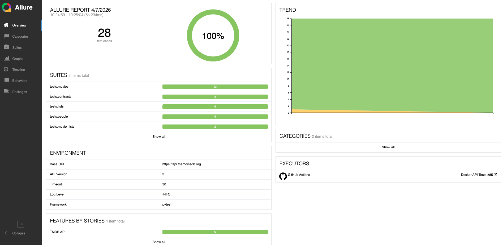
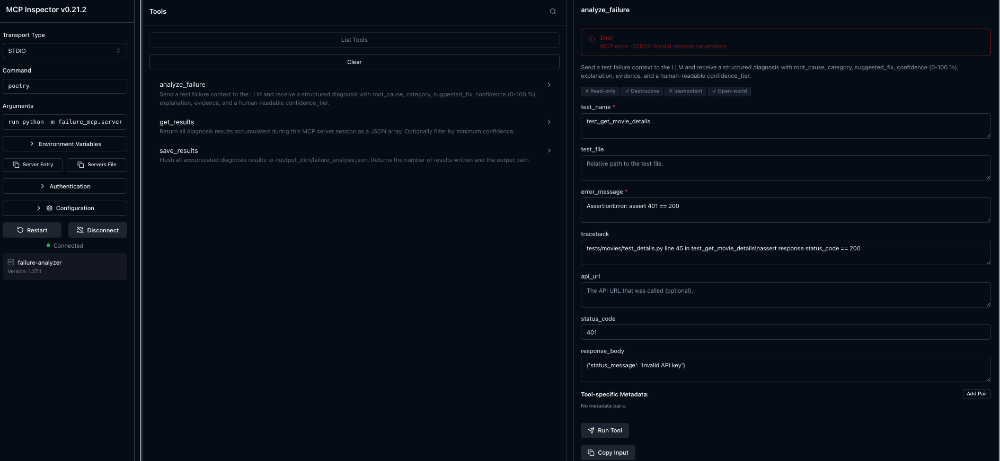
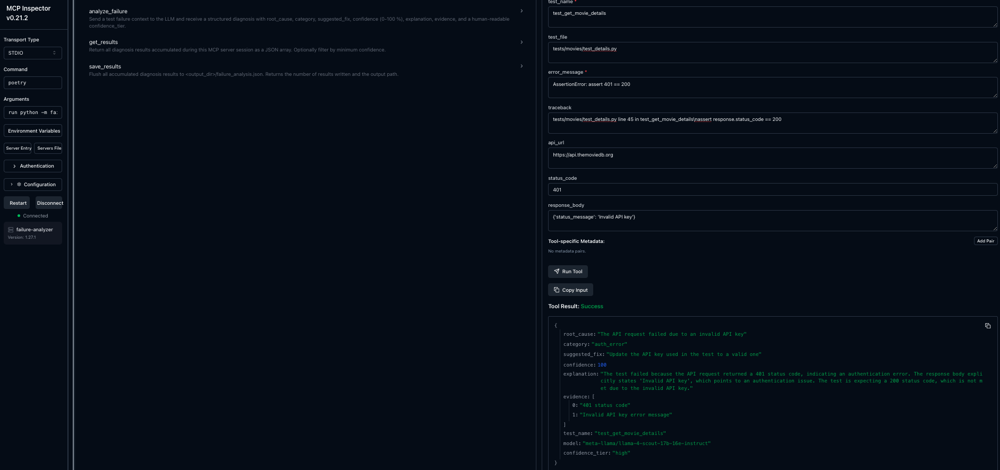

# mdb_api_layer

[](https://github.com/pgundlupetvenkatesh/mdb_api_layer/actions/workflows/tmdb_test.yml)
[](https://github.com/pgundlupetvenkatesh/mdb_api_layer/actions/workflows/build_docs.yml)</br>


-1.34%2B-blue?logo=kubernetes&logoColor=white)


API Testing Framework for The Movie Database ([TMDB](https://themoviedb.org)) with Python

## Overview

A Python-based API testing framework for TMDB API, featuring structured test organization, JSON schema validation, 
Contract tests, and comprehensive response assertions.

###### View live code documentation & latest test report [here](https://pgundlupetvenkatesh.github.io/mdb_api_layer/)

## Features

- RESTful API client with session management (GET, POST, PUT, DELETE)
- Multiple API clients: Movies, People, Lists, Account, Search
- JSON schema validation for response structure
- Consumer-driven contract testing with Pact
- Data-driven testing with YAML test data and dynamic generators
- Reusable field assertion helpers (bool, str, int, float, date)
- Factory-pattern pytest fixtures for flexible API instance creation
- Structured logging with [Loguru](https://github.com/Delgan/loguru) (configurable level & file output)
- Configurable environment-based settings via `.env`
- AI-powered test failure analysis using open-source LLMs via [Groq](https://groq.com/) (opt-in)
- Pytest integration with HTML and Allure reporting
- Sphinx documentation with GitHub Pages deployment

## Architecture



### How the Layers Connect

| Layer | Responsibility |
|---|---|
| **Config** | Loads `.env`, exposes `Config` class, sets up Loguru logging |
| **API** | `BaseAPI` handles HTTP + auth; endpoint classes (`MoviesAPI`, etc.) add domain methods |
| **Tests** | `conftest.py` wires fixtures/hooks; suites use helpers, schemas, and data-driven YAML |
| **Contracts** | Pact CDC tests generate `.json` contract files in `tests/pacts/` |
| **Docker** | `Dockerfile` builds image; `docker-compose.yml` runs tests locally with `.env` and volume |
| **CI/CD** | Two GH Actions workflows: one for Docker test runs + report deploy, one for Sphinx docs |
| **Docs** | Sphinx auto-generates API docs from docstrings, deployed to GitHub Pages |

## Prerequisites

- Python 3.10+
- [Poetry](https://python-poetry.org/) for dependency management
- TMDB API account and API key
- [Docker](https://www.docker.com/get-started) for containerized test runs (optional)

## Installation

```bash
# Clone the repository
git clone https://github.com/pgundlupetvenkatesh/mdb_api_layer.git
cd mdb_api_layer

# Install dependencies
poetry install

# Add new Python package dependencies
poetry add <package_name>

## Testing
poetry run pytest tests/movie_lists/test_popular.py -v -s
```
### Sanity Checks

```
poetry env info
poetry show
```

## Configuration

### Getting TMDB API Credentials

1. **Create a TMDB account** at [themoviedb.org](https://www.themoviedb.org/signup)
2. **Request an API key:**
   - Go to [Settings → API](https://www.themoviedb.org/settings/api)
   - Click "Create" or "Request an API Key"
   - Choose "Developer" for personal/testing use
   - Fill in the application details (use your project URL or localhost for testing)
   - Once approved, you'll receive your **API Key (v3 auth)** and **API Read Access Token**
3. **Locate your credentials:**
   - **API Key**: Found under "API Key (v3 auth)" on the API settings page
   - **Auth Token**: Found under "API Read Access Token (v4 auth)" — this is your Bearer token

### Setting Up Environment Variables

Create a `.env` file in the project root (this file is ignored):

```bash
# Required
TMDB_API_KEY=your_api_key_here
TMDB_AUTH_TOKEN=your_read_access_token_here

# Optional (defaults shown)
TMDB_BASE_URL=https://api.themoviedb.org
TMDB_API_VERSION=3
TMDB_TIMEOUT=30
TMDB_USER_ACCESS_TOKEN=your_user_access_token_here
```

**Alternative:** Export variables directly in your terminal:

```bash
export TMDB_API_KEY="your_api_key_here"
export TMDB_AUTH_TOKEN="your_read_access_token_here"
```

### 🚀 GitHub Pages(GHP) Setup
The project uses multi-deployment strategy to host both Sphinx doc and Pytest HTML reports on the same GitHub Pages site.
I am using [peaceiris/actions-gh-pages](https://github.com/peaceiris/actions-gh-pages) action across two separate workflows:
* API Tests: Generate and deploys test reports to /report.
* Docs: Build and deploys docs to /docs.

#### Configs
1. **Settings > Pages:** - To support both docs and reports, the repository is configured to deploy from a specific branch 
rather the default "GitHub Actions" method.<br>
**Source:** Deploy from a branch<br>
**Branch:** gh-pages<br>
**Folder:** / (root)<br>
2. **Environment & Protection Rules** - Modified the default `github-pages` environment to allow the automated 
workflows to push updates.<br>
**Settings > Environments > github-pages:**<br>
**Deployment branches:** Change from `Selected branches` to `All branches` or `No Restriction`. This allows the 
peaceiris/actions-gh-pages action to push the gh-pages branch without being blocked by 
"Main-only" protection rules GitHub Docs: Deployment Branches.<br>
3. **Settings > Actions > General:**<br>
**Workflow permissions:** Set to Read and write permissions. This grants the GITHUB_TOKEN the authority to create and 
update the gh-pages branch GitHub Docs: Token Permissions.<br>

### Environment Variables Reference

| Variable                  | Description                               | Required   | Default                    |
|---------------------------|-------------------------------------------|------------|----------------------------|
| `TMDB_API_KEY`            | Your TMDB API key (v3 auth)               | Yes        | -                          |
| `TMDB_AUTH_TOKEN`         | Your TMDB API read access token (v4 auth) | Yes        | -                          |
| `TMDB_BASE_URL`           | Base URL for TMDB API                     | No         | https://api.themoviedb.org |
| `TMDB_API_VERSION`        | API version to use (3 or 4)               | No         | 3                          |
| `TMDB_TIMEOUT`            | Request timeout in seconds                | No         | 30                         |
| `TMDB_USER_ACCESS_TOKEN`  | User Access Token for Lists API (v4 auth) | No         | -                          |
| `TMDB_ACCOUNT_ID`         | TMDB account ID                           | No         | `12016691`                 |
| `TMDB_SESSION_ID`         | Session ID for authenticated requests     | No         | -                          |
| `TMDB_REQ_TOKEN`          | Request token for authentication          | No         | -                          |
| `TMDB_MOVIE_ID`           | Default movie ID for tests                | No         | `346698`                   |

## Logging

The framework uses [Loguru](https://github.com/Delgan/loguru) for structured logging with colored output and option to
save logs to files. You can control the log level to filter messages based on severity.

### Log Levels

| Level    | Description                          |
|----------|--------------------------------------|
| DEBUG    | Detailed diagnostic information      |
| INFO     | General operational messages         |
| WARNING  | Potential issues                     |
| ERROR    | Error events                         |
| CRITICAL | Serious failures                     |

### Log level hierarchy
| Level Set | Logs Shown                            |
|-----------|---------------------------------------|
| DEBUG     | DEBUG, INFO, WARNING, ERROR, CRITICAL |
| INFO      | INFO, WARNING, ERROR, CRITICAL        |
| WARNING   | WARNING, ERROR, CRITICAL              |
| ERROR     | ERROR, CRITICAL                       |
| CRITICAL  | CRITICAL only                         |

### Controlling Log Level

* Default (INFO) - `poetry run pytest tests/*`
* Debug logging - `poetry run pytest tests/* --loguru-log-level=DEBUG`
* Only errors - `poetry run pytest tests/* --loguru-log-level=ERROR`

### Log Output
By default, logs are printed to the console with color coding. You can also add `--log-to-file` option to write logs
to a `logs/test_run.log` for persistent storage and later analysis.

`poetry run pytest tests/* --log-to-file`

### Running Tests After Setup

```bash
# Verify your setup
poetry install

# Run tests
poetry run pytest tests/movie_lists/test_popular.py -v -s
```

> **Note:** Keep your API credentials secure. Never commit `.env` files or expose tokens in public repositories.

## Project Structure

```
mdb_api_layer/
├── api/
│   ├── base_api.py             # Base API client with HTTP methods (GET, POST, PUT, DELETE)
│   ├── movies_api.py           # Movies endpoint implementation
│   ├── people_api.py           # People endpoint implementation
│   ├── lists_api.py            # Lists endpoint implementation (v4 API)
│   ├── account_api.py          # Account endpoint implementation
│   └── search_api.py           # Search endpoint implementation
├── config/
│   └── config.py               # Environment configuration & Loguru logging setup
├── tests/
│   ├── allure/
│   │   └── categories.json
│   ├── ai_analysis/                 # Generated analysis reports (gitignored)
│   │   └── failure_analysis.json
│   ├── conftest.py             # Pytest fixtures, hooks & logging CLI options
│   ├── contracts/
│   │   ├── test_movie_details.py   # Movie details contract tests (Pact CDC)
│   │   └── test_popular_movies.py  # Popular movies contract tests (Pact CDC)
│   ├── data/
│   │   ├── data_loader.py      # YAML test data loader with dynamic generators
│   │   ├── test_data.yaml      # Parametrized test data for data-driven tests
│   │   └── movie_ids.txt       # Movie IDs for random test data generation
│   ├── helpers/
│   │   ├── failure_analyzer.py     # LLM failure analysis client
│   │   ├── field_assertions.py     # Reusable field validation assertion mixin
│   │   ├── response_assertions.py  # HTTP response assertion helpers
│   │   └── test_data_generators.py # Dynamic test data generators
│   ├── movies/
│   │   ├── test_details.py     # Movie details integration tests
│   │   ├── test_add_rating.py  # Add rating tests
│   │   └── test_delete_rating.py   # Delete rating tests
│   ├── movie_lists/
│   │   └── test_popular.py     # Popular movies list tests
│   ├── people/
│   │   └── test_details.py     # People details integration tests
│   ├── lists/
│   │   └── test_update.py      # Lists update tests (v4 API)
│   ├── pacts/
│   │   └── *.json              # Generated Pact contract files
│   └── schemas/
│       ├── movie_schema.json           # Movie details JSON schema
│       ├── popular_movies_schema.json  # Popular movies JSON schema
│       ├── person_details_schema.json  # Person details JSON schema
│       ├── add_delete_rating_schema.json # Rating response JSON schema
│       └── generic_schema.json         # Generic/error response JSON schema
├── docs/
│   ├── conf.py                 # Sphinx configuration
│   ├── index.rst               # Documentation index
│   ├── api.rst                 # API module documentation
│   ├── config.rst              # Config module documentation
│   ├── tests.rst               # Tests module documentation
│   ├── make.bat                # Windows build script
│   └── Makefile                # Unix build script
├── logs/
│   └── test_run.log            # Log file (when --log-to-file is used)
├── failure_mcp/
│   ├── __init__.py
│   ├── server.py               # entry point, registers tools, runs stdio server
│   └── tools/
│       ├── __init__.py
│       ├── analyze_test_failure.py     # TOOLS list + handle_call() dispatcher
├── report/
│   └── tmdb_report.html        # Generated HTML test reports
├── .env                        # Environment variables (not committed)
├── .gitignore
├── Dockerfile                  # Docker image definition for containerized test runs
├── docker-compose.yml          # Docker Compose config for local containerized runs
├── pyproject.toml              # Poetry configuration & pytest settings
├── k8s/                        # Kubernetes Job manifests for test orchestration
│   ├── integration-test-job.yaml
│   └── contract-test-job.yaml
├── poetry.lock
└── README.md
```

## Running Tests

```commandline
# Run all tests (integration + contract)
poetry run pytest tests/ -v

# Run all tests except contract tests
poetry run pytest tests/ -v -m "not contract"

# Run tests by module
poetry run pytest tests/movies/ -v -s
poetry run pytest tests/people/ -v -s
poetry run pytest tests/lists/ -v -s
poetry run pytest tests/movie_lists/ -v -s

# Run a specific test function
poetry run pytest tests/movie_lists/test_popular.py::TestClassName::test_func_name -v -s

# Run with debug logging
poetry run pytest tests/ -v -s --loguru-log-level=DEBUG

# Run with log file output
poetry run pytest tests/ -v -s --log-to-file

# Run with HTML report
poetry run pytest tests/ --html=report/tmdb_report.html --self-contained-html -v -s

# Clean run with Allure reporting
rm -rf allure-results && poetry run pytest tests/ --alluredir=allure-results -v && allure serve allure-results
# View report (requires Allure CLI installed locally: brew install allure)
allure serve allure-results

# Generate static HTML from results. allure-report/ contains a full static site
allure generate allure-results -o allure-report --clean

# Keep history between local runs
cp -r allure-report/history allure-results/ 2>/dev/null || true
```

## Running Tests in Docker

Tests run inside Docker containers for a consistent, isolated environment — no local Python or dependency setup needed.
Integration and contract tests run **in parallel** as separate containers from the same image.

### Prerequisites
- [Docker](https://www.docker.com/get-started) installed and running

### Using Docker Compose (Recommended for Local)

```bash
# Build and run both test suites in parallel (reads secrets from .env file)
docker compose up --build

# Flow
build image (mdb-api-tests)
  ↓
start 2 containers in parallel
  ├── tmdb-api-integration-tests  → pytest tests/ -m "not contract"
  └── tmdb-api-contract-tests     → pytest tests/contracts/ -m contract
  ↓
reports saved to ./report/

# Run in detached mode - Run in background
docker compose up --build -d

# View logs for a specific service
docker compose logs -f integration_tests
docker compose logs -f contract_tests

# Tear down
docker compose down
```

Both containers share the same `./report/` volume mount but write to **separate report files**:
- `tmdb_non_contract_report.html` — integration tests
- `tmdb_contract_report.html` — contract tests

### Using Docker Directly (Single Run)

```bash
# Build the image
docker build -t mdb-api-tests .

# Run all tests in one container (pass env vars explicitly)
docker run --rm \
  -e TMDB_API_KEY=your_key \
  -e TMDB_AUTH_TOKEN=your_token \
  -v $(pwd)/report:/app/report \
  mdb-api-tests
```

### How It Works

| File                 | Role                                                                 |
|----------------------|----------------------------------------------------------------------|
| `Dockerfile`         | Defines the image: Python 3.12-slim, installs Poetry & dependencies  |
| `docker-compose.yml` | Runs integration & contract tests in parallel via two services       |
| GH CI workflow       | Builds with Buildx caching, runs parallel compose, merges reports    |

### Parallel Execution Architecture

```
docker-compose.yml
  │
  ├── x-common-config (shared anchor)
  │     ├── build: .
  │     ├── image: mdb-api-tests
  │     ├── env_file: .env
  │     └── volumes: ./report:/app/report
  │
  ├── integration_tests (container: tmdb-api-integration-tests)
  │     └── pytest tests/ -m "not contract" → tmdb_non_contract_report.html
  │
  └── contract_tests (container: tmdb-api-contract-tests)
        └── pytest tests/contracts/ -m contract → tmdb_contract_report.html
```

### CI/CD (GitHub Actions)

In CI, tests run inside the same Docker image with additional optimizations:
- **Docker Buildx** for layer caching between workflow runs
- Secrets are written to `.env` file (never baked into the image)
- **Parallel execution** via `docker compose up --no-build` (image pre-built by Buildx)
- Individual HTML reports are **merged** into `merged_tmdb_full_report.html` using `pytest-html-report-merger`
- Merged report is deployed to GitHub Pages
- If tests fail, the workflow still merges and deploys the report before marking the job as failed

## Contract Testing

This project includes **consumer-driven contract testing(CDC)** using [Pact](https://pact.io/) to verify API structure 
expectations without making real network calls.

### Running Contract Tests

```bash
# Run a specific contract test. -m is a marker defined in .toml file
poetry run pytest tests/contracts/test_movie_details.py -v -m contract

# Run all contract tests
poetry run pytest tests/contracts/ -v -m contract

# With report generation
poetry run pytest tests/contracts/ --html=report/tmdb_contract_report.html --self-contained-html -v -s -m contract

# Run all tests except contract tests
poetry run pytest tests/ -v -m "not contract"

# Run all tests (integration + contract)
poetry run pytest tests/ -v

# With report generation for all tests
poetry run pytest tests/ --html=report/tmdb_full_report.html --self-contained-html -v -s
```

### Generated Pact Files

Contract tests generate JSON pact files in `tests/pacts/`:

```
tests/pacts/
├── test_movie_details-api_pvd.json   # Movie details contract
└── test_popular_movies-api_pvd.json  # Popular movies contract
```

Pact files document the expected request/response structure and can be:
- Versioned for tracking in git
- Shared with API providers to verify
- Used by CI/CD to detect breaking changes

## AI-Powered Failure Analysis

When a test fails, the framework can automatically send the failure context to an open-source LLM for instant
root-cause diagnosis. This is **disabled by default** — no API calls are made unless the user explicitly opt in.

### How It Works

```
Test Fails
  ↓
pytest_runtest_makereport hook captures:
  • test name & file
  • error message & traceback
  • API URL, status code, response body (if available)
  ↓
FailureAnalyzer sends context to Groq API (Llama 4 Scout / Qwen 3)
  ↓
LLM returns structured JSON diagnosis:
  { root_cause, category, suggested_fix, confidence, explanation, evidence }
  ↓
Diagnosis is:
  • Logged to console (🤖 emoji prefix)
  • Attached to Allure report as JSON
  • Saved to tests/ai_analysis/failure_analysis.json at session end
```

### Failure Categories
LLM classifies each failure into one of these categories:

| Category           | Meaning                                                        |
|--------------------|----------------------------------------------------------------|
| `api_bug`          | API returned unexpected response (status code, missing field)  |
| `test_bug`         | Test assertion or logic is incorrect                           |
| `data_issue`       | Test data is stale, invalid, or resource was deleted           |
| `timeout`          | Response time exceeded threshold                               |
| `auth_error`       | Authentication/authorization failure (expired token, key)      |
| `schema_mismatch`  | Response doesn't match Pydantic model or Pact contract         |
| `environment`      | Config, connectivity, or environment setup issue               |

### Setup

1. **Get a free Groq API key** at [console.groq.com](https://console.groq.com/)
2. **Add to `.env` file:**
   ```bash
   GROQ_API_KEY=your_groq_api_key_here
   AI_ANALYSIS_ENABLED=true          # or use --failure-analysis CLI flag instead
   ```
3. **Install dependencies** (should be in `pyproject.toml`):
   ```bash
   poetry install  # groq package is included
   ```

### Usage

```bash
# Enable via CLI flag to keep .env clean
poetry run pytest tests/ --failure-analysis -v

# Or enable via environment variable
AI_ANALYSIS_ENABLED=true poetry run pytest tests/ -v

# Combine with other options
poetry run pytest tests/ --failure-analysis --loguru-log-level=DEBUG --alluredir=allure-results -v
```

When enabled, each failed test produces a console log like:
```
🤖 AI Analysis [auth_error]: The Bearer token has expired, causing a 401 Unauthorized response.
```

### Output

| Destination                               | Format | When                        |
|-------------------------------------------|--------|-----------------------------|
| Console log                               | Text   | Immediately on failure      |
| Allure report (🤖 AI Failure Analysis)    | JSON   | Attached to failed test     |
| `tests/ai_analysis/failure_analysis.json` | JSON   | End of test session         |

**Sample diagnosis:**
```json
{
  "root_cause": "The movie ID 999999 does not exist, causing a 404 response",
  "category": "data_issue",
  "suggested_fix": "Update test data to use a valid movie ID from TMDB",
  "confidence": 90,
  "explanation": "The test expects a 200 OK but the API returned 404 Not Found because the movie resource was deleted or never existed. Refresh test data with current valid IDs.", 
  "evidence": ["HTTP status code: 404", "Response body: {'status_code':34, 'status_message':'The resource you requested could not be found.'}"],
  "test_name": "test_get_movie_details[invalid_id]",
  "model": "meta-llama/llama-4-scout-17b-16e-instruct"
}
```


### Supported Models

The default model is `meta-llama/llama-4-scout-17b-16e-instruct` on Groq's free tier.
Override via environment variable:
```bash
# In .env
AI_MODEL=qwen/qwen3-32b
```

### CI Integration

In GitHub Actions, the feature works automatically when `GROQ_API_KEY` secret and `AI_ANALYSIS_ENABLED` variable is set in repository
settings. The workflow writes them to the `.env` file so both Docker containers have access. Analysis results are
attached to the Allure report deployed to GitHub Pages.

### AI Environment Variables

| Variable               | Description                               | Required   | Default                                      |
|------------------------|-------------------------------------------|------------|----------------------------------------------|
| `AI_ANALYSIS_ENABLED`  | Enable AI failure analysis                | No         | `false`                                      |
| `GROQ_API_KEY`         | Groq API key for LLM access               | If enabled | -                                            |
| `AI_MODEL`             | LLM model identifier on Groq              | No         | `meta-llama/llama-4-scout-17b-16e-instruct`  |

> **Note:** Groq free tier has rate limits. For large test suites with many failures, analysis may be throttled.
> The analyzer gracefully handles errors — if an LLM call fails, the test result is unaffected.

## Dependencies

### Runtime
- requests — HTTP client
- python-dotenv — `.env` file loading
- pydantic — Model validation
- pyyaml — YAML test data parsing
- loguru — Structured logging
- groq — LLM client for AI failure analysis

### Development
- pytest — Test framework
- pytest-html — HTML report generation
- pytest-html-report-merger — Merges multiple HTML reports into one
- allure-pytest — Allure reporting
- sphinx — Documentation generation
- pytest-order — Test execution ordering
- pact-python — Consumer-driven contract testing

```bash
# Update dependencies
poetry update
```

## Documentation

```commandline
cd docs
make html
```
To clean previous builds and rebuild run - `make clean && make html`

### View documentation
Open `docs/_build/html/index.html` in your web browser.


Click [here](https://pgundlupetvenkatesh.github.io/mdb_api_layer/docs/index.html) to See the current live documentation

## Reports

### Pytest HTML Report
```bash
poetry run pytest tests/ --html=report/tmdb_report.html --self-contained-html -v -s
```

Generate a simple pytest HTML test report:
Open the generated `tmdb_report.html` in your web browser to view the test results.


### Allure Report
```bash
# Generate Allure results
poetry run pytest tests/ --alluredir=allure-results -v
```
`--alluredir` option tells pytest to save the test results in a format that Allure can process.
See [Running Tests](#running-tests) section for more Allure details.


### Docker Parallel Reports
When running via `docker compose`, two separate reports are generated and then merged in CI:

| Report                          | Source             |
|---------------------------------|--------------------|
| `tmdb_non_contract_report.html` | Integration tests  |
| `tmdb_contract_report.html`     | Contract tests     |
| `merged_tmdb_full_report.html`  | Combined (CI only) |

Click [here](https://pgundlupetvenkatesh.github.io/mdb_api_layer/report/merged_tmdb_full_report.html) to see the latest merged report

## Running Tests in Kubernetes(Optional)

Tests can also run in Kubernetes for container orchestration. Both test suites run as parallel **Jobs** on your local 
Docker Desktop K8s cluster.

### Prerequisites
- Docker Desktop with [Kubernetes enabled](https://docs.docker.com/desktop/kubernetes/)
- `kubectl` CLI configured (`kubectl cluster-info` should respond)

### Step-by-step

Run the [run_k8s_tests.sh](./run_k8s_tests.sh) file to execute k8 commands in sequence.
Feel free to see the step-by-step commands in the script.

### How It Works

```
k8s/
├── integration-test-job.yaml   → Job: pytest tests/ -m "not contract"
└── contract-test-job.yaml      → Job: pytest tests/contracts/ -m contract

.env → kubectl create secret → tmdb-secrets (K8s Secret)
                                    ↓
                          envFrom: secretRef
                                    ↓
                    ┌───────────────────────────────────┐
                    │         mdb-api-tests image       │
                    ├──────────────┬────────────────────┤
                    │ integration  │    contract        │
                    │ tests Job    │    tests Job       │
                    └──────────────┴────────────────────┘
```

## MCP Integration

The framework ships a [Model Context Protocol (MCP)](https://modelcontextprotocol.io/) server that exposes
`FailureAnalyzer` capabilities as callable tools for any MCP-compatible AI client
(Claude Desktop, Cursor, VS Code Copilot Chat, custom agents, etc.).

### Project Structure

```
failure_mcp/
├── __init__.py
├── server.py                   # Entry point — registers tools, runs stdio transport
└── tools/
    ├── __init__.py
    └── analyze_test_failure.py # TOOLS list + handle_call() dispatcher
```

> `failure_analyzer.py` is **not modified** — the MCP server wraps the existing singleton.

### Exposed Tools

| Tool              | Required Args                | Optional Args                                                       | Description                                                                       |
|-------------------|------------------------------|---------------------------------------------------------------------|-----------------------------------------------------------------------------------|
| `analyze_failure` | `test_name`, `error_message` | `test_file`, `traceback`, `api_url`, `status_code`, `response_body` | Send failure context to LLM and get structured diagnosis                          |
| `get_results`     | —                            | `min_confidence` (0–100, default `0`)                               | Return accumulated diagnosis results, optionally filtered by confidence threshold |
| `save_results`    | —                            | `output_dir` (default `"ai_analysis"`)                              | Flush all results to `<output_dir>/failure_analysis.json`                         |

### Sample `analyze_failure` Response

```json
{
  "root_cause": "The Bearer token has expired, causing a 401 Unauthorized response.",
  "category": "auth_error",
  "suggested_fix": "Refresh the TMDB_AUTH_TOKEN in your .env file and re-run the tests.",
  "confidence": 92,
  "explanation": "The API rejected the request with HTTP 401...",
  "evidence": ["HTTP status code 401", "Response body contains 'Invalid API key'"],
  "test_name": "test_get_movie_details",
  "model": "meta-llama/llama-4-scout-17b-16e-instruct",
  "confidence_tier": "high"
}
```

`confidence_tier` is derived from the raw `confidence` score:

| Score | Tier                       |
|-------|----------------------------|
| >= 80 | `high` — act on it         |
| 50–79 | `medium` — review it       |
| < 50  | `low` — treat with caution |

### Testing MCP Server

[MCP Inspector](https://github.com/modelcontextprotocol/inspector) is a web-based UI to interactively call MCP tools
and inspect responses — no AI client needed.

#### Prerequisites
Node.js must be installed (`brew install node` on macOS).

#### Launch

```bash
npx @modelcontextprotocol/inspector
```

Opens at `http://localhost:6274` in your browser.

#### Step 1 — Connect

> **Important:** MCP Inspector does not have a `cwd` field. Use the **full path** to the `poetry` binary so it
> resolves the correct virtual environment regardless of where Inspector is launched from.

| Field              | Value                                                |
|--------------------|------------------------------------------------------|
| Transport Type     | `STDIO`                                              |
| Command            | `/Users/pratikgv/git/mdb_api_layer/.venv/bin/poetry` |
| Arguments          | `run python -m failure_mcp.server`                   |

Expand **Environment Variables** and add:

| Key                 | Value                               |
|---------------------|-------------------------------------|
| `AI_ANALYSIS_ENABLED` | `true`                            |
| `GROQ_API_KEY`      | your actual key from `.env`         |
| `PYTHONPATH`        | `/Users/pratikgv/git/mdb_api_layer` |

Click **Connect**. On success the right panel shows all 3 tools: `analyze_failure`, `get_results`, `save_results`.



#### Step 2 — Call `analyze_failure`

Select the tool, paste the input JSON and click **Run**:

```json
{
  "test_name": "test_get_movie_details",
  "error_message": "HTTP 401 Unauthorized: Invalid API key",
  "test_file": "tests/movies/test_details.py",
  "traceback": "Traceback (most recent call last): ...",
  "api_url": "https://api.themoviedb.org/3/movie/12345",
  "status_code": 401,
  "response_body": {"status_code": 7, "status_message": "Invalid API key: You must be granted a valid key."}
}
```

Expected response includes `root_cause`, `category`, `confidence` (0–100), `confidence_tier`, `evidence`, and `suggested_fix`.



#### Step 3 — Call `get_results`

Returns all diagnoses accumulated in the current session. Optionally filter by confidence:

```json
{ "min_confidence": 80 }
```

Pass `{}` (empty object) to return everything.

#### Step 4 — Call `save_results`

Flushes all accumulated results to `ai_analysis/failure_analysis.json`:

```json
{ "output_dir": "ai_analysis" }
```

Returns `{ "saved": <count>, "path": "ai_analysis/failure_analysis.json" }`.

#### Troubleshooting Connection Errors

| Symptom                                                  | Fix                                                                                                                                |
|----------------------------------------------------------|------------------------------------------------------------------------------------------------------------------------------------|
| `Connection Error — Check if your MCP server is running` | Verify the Command path is correct with `which poetry`                                                                             |
| `ModuleNotFoundError: No module named 'tests'`           | Make sure `PYTHONPATH` is set to the project root                                                                                  |
| `AI analysis disabled` in response                       | Confirm `AI_ANALYSIS_ENABLED=true` and `GROQ_API_KEY` are set in Environment Variables                                             |
| Server starts but immediately exits                      | Run `PYTHONPATH=. poetry run python -m failure_mcp.server` in terminal — a hanging prompt (no output) means it's working correctly |

### Running the MCP Server

```bash
# Requires AI_ANALYSIS_ENABLED=true and GROQ_API_KEY in .env
poetry run python -m failure_mcp.server
```

### MCP Client Config

Add to `~/.cursor/mcp.json` (Cursor) or Claude Desktop's settings:

```json
{
  "mcpServers": {
    "failure-analyzer": {
      "command": "poetry",
      "args": ["run", "python", "-m", "failure_mcp.server"],
      "cwd": "/path/to/mdb_api_layer",
      "env": {
        "AI_ANALYSIS_ENABLED": "true",
        "GROQ_API_KEY": "<your-groq-key>"
      }
    }
  }
}
```

Once connected, your AI client can call `analyze_failure` directly by passing a failure context dict — 
no changes to any test file needed.

## Future Improvements

* AI-based test generation
* Load perf testing with Locust
* Send test results to Grafana
